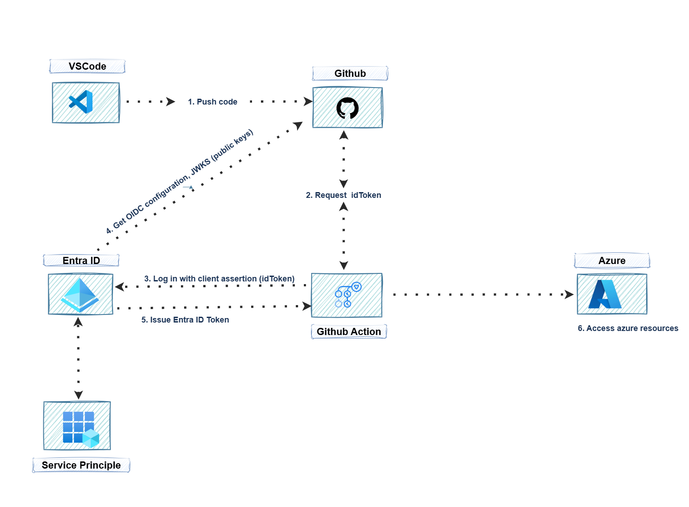

```markdown
# Project 1: Secure Azure Login with OIDC

## Overview

This project demonstrates how to securely connect GitHub Actions workflows to Azure using OpenID Connect (OIDC), eliminating the need for storing long-lived client secrets in CI/CD pipelines. By leveraging federated identity, this approach reduces security risks and simplifies credential management in automated workflows.

---

## Problem Statement

Many organizations face challenges with secrets in CI/CD pipelines:

- Manual secret rotation increases operational overhead.
- Storing static secrets in repositories or environments can lead to leaks.
- Maintaining secret access for multiple pipelines slows down delivery velocity.

This project solves these problems by using token-based authentication with OIDC, providing a secure, automated, and auditable method for Azure resource management from GitHub workflows.

---

## Project Goals

- Enable secure authentication between GitHub Actions and Azure without storing secrets.
- Implement least-privilege access using Azure service principals.
- Demonstrate a zero-secret authentication flow.
- Validate connectivity via a GitHub Actions workflow with Azure CLI commands.

---

## Key Components

1. Azure AD App Registration  
   Configured for federated identity with GitHub repositories.

2. Service Principal (SP)  
   Provides scoped access to Azure resources using minimal permissions.

3. GitHub Actions Workflow  
   Uses azure/login@v1 action to authenticate to Azure via OIDC tokens.

4. GitHub Secrets  
   Stores identifiers such as client ID, tenant ID, and subscription ID for the SP (optional if fully OIDC-based).

---

## Business Impact

- Secures pipelines by removing embedded secrets.
- Enables auditable and automated deployments in Azure.
- Reduces operational overhead and improves developer productivity.
- Supports enterprise compliance requirements for identity management.

---

## Implementation Steps

1. Register Azure AD Application  
   - Create an Azure AD app registration and configure a federated credential for GitHub Actions.
   - Define which repository and branch are allowed to request tokens.

2. Create a Service Principal (SP)  
   - Assign the SP minimal required permissions to interact with Azure resources.

3. Assign Permissions  
   - Use least privilege principles for roles (Contributor or custom role scoped to resources).

4. Configure GitHub Repository Secrets  
   - Store identifiers such as AZURE_CLIENT_ID, AZURE_TENANT_ID, and AZURE_SUBSCRIPTION_ID (if necessary).
   - Grant write permission for id-token in the workflow for OIDC authentication.

5. Create GitHub Actions Workflow  
   - Place the workflow YAML file under .github/workflows/.
   - Configure the workflow to:
     - Checkout repository code.
     - Authenticate to Azure using OIDC.
     - Optionally verify access by listing Azure resources.

6. Test and Validate  
   - Push workflow to GitHub and confirm it triggers on the target branch.
   - Ensure Azure CLI commands execute successfully without exposing secrets.

---

## Usage

Once the project is configured:

1. Developers push changes to the specified branch (e.g., main).  
2. GitHub Actions triggers the workflow automatically.  
3. The workflow authenticates to Azure using the federated identity.  
4. Azure resources can be managed securely and auditable actions are logged.

No manual secret management is required in the CI/CD pipeline.

---

## Prerequisites

- Azure subscription with admin rights.
- GitHub repository with admin access.
- Basic familiarity with GitHub Actions and Azure identity management.

---

## Solution architecture



---

## Contributing

Contributions are welcome! Whether it’s bug fixes, workflow improvements, or documentation enhancements, feel free to submit a pull request. Please follow standard GitHub workflow practices:

- Fork the repository.
- Make your changes in a separate branch.
- Submit a pull request for review.

---

## License

This project is licensed under the MIT License. You are free to use, modify, and distribute this project in accordance with the license.
---

## References

- [Azure AD Workload Identity Federation](https://learn.microsoft.com/en-us/azure/active-directory/develop/workload-identity-federation-create-trust)  
- [GitHub Actions: Azure Login](https://github.com/Azure/login)
```


